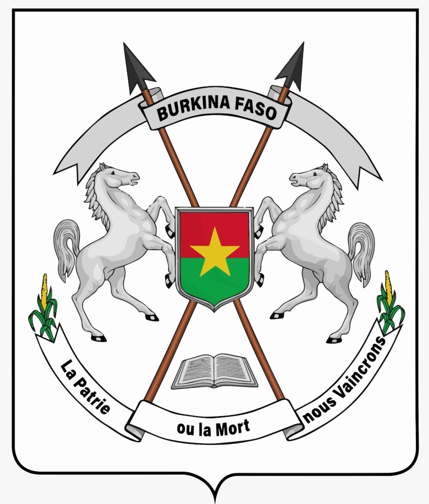

# Plateforme Web - Orphelins et Enfants Vulnérables (OEV)



Bienvenue sur la plateforme web de prise en charge des **Orphelins et Enfants Vulnérables (OEV)**. Cette application est développée avec le framework **Laravel** et intègre un **Portail Public** ainsi qu'un **Espace Administration / Agents**.

---

## 🌟 Fonctionnalités Principales

### 🟢 1. Portail Public (Usagers & Tuteurs)
L'interface publique adopte la charte graphique institutionnelle verte avec l'armoirie officielle. Elle comprend :

- **Accueil (`/`)** : Présentation globale, piliers d'accompagnement (Éducation, Santé, Protection sociale, Attestation OEV), résumé du parcours utilisateur et statistiques d'impact.
- **Demande (`/demande`)** : Formulaire d'initiation et de soumission de demande de prise en charge en ligne avec dépôt de pièces justificatives (Acte de naissance, CNIB tuteur, etc.).
- **Suivi de Récépissé (`/suivi`)** : Outil de suivi de dossier par numéro de récépissé (ex. `OEV-2026-8942`) avec barre de progression de l'instruction :
  1. *Soumission de la demande*
  2. *Vérification des pièces par l'équipe OEV*
  3. *Évaluation et validation de la prise en charge*
  4. *Notification de la décision et accompagnement*
- **À Propos (`/a-propos`)** : Présentation du programme OEV, des critères d'accès aux services et foire aux questions (FAQ).

---

### 🛡️ 2. Espace Administration & Agents (`/admin/*`)
L'espace réservé aux agents et responsables OEV repose sur une architecture Blade modulaire (`layouts/app.blade.php`) :

- **Dashboard (`/admin/dashboard`)** : Métriques clés, graphiques des ventes/allocations, activités récentes de l'équipe.
- **Gestion des Utilisateurs & Rôles** :
  - Liste des utilisateurs (`/admin/users`)
  - Ajout d'un compte utilisateur (`/admin/users/create`)
  - Fiche détaillée (`/admin/users/{id}`)
- **Agents Intelligent (`/admin/create-agent`)** : Formulaire de configuration des agents virtuels et automatisations.
- **UI Kit & Outils** : Profil (`/admin/profile`), Paramètres (`/admin/settings`), Tables (`/admin/tables`), Formulaires (`/admin/forms`), Composants (`/admin/components`), Modales (`/admin/modals`), Alertes (`/admin/alerts`).

---

## 🛠️ Structure du Projet

```text
OEV/
├── app/
├── config/
├── public/
│   └── assets/
│       ├── css/
│       │   ├── bootstrap.min.css
│       │   ├── style.css
│       │   └── public.css            # Style institutionnel vert de l'interface publique
│       ├── images/
│       │   └── armoiries-1000x1174.png  # Image des Armoiries Officielles
│       └── vendors/
├── resources/
│   └── views/
│       ├── layouts/
│       │   ├── app.blade.php         # Master Layout Administration
│       │   ├── guest.blade.php       # Layout Authentification & Erreurs
│       │   └── public.blade.php      # Master Layout Portail OEV
│       ├── public/
│       │   ├── home.blade.php        # Page Accueil
│       │   ├── demande.blade.php     # Page Demande en ligne
│       │   ├── suivi.blade.php       # Page Suivi de récépissé
│       │   └── about.blade.php       # Page À propos & FAQ
│       ├── errors/
│       │   ├── 404.blade.php
│       │   └── 500.blade.php
│       ├── index.blade.php           # Admin Dashboard
│       ├── users.blade.php           # Admin Users List
│       └── ...
└── routes/
    └── web.php                       # Déclaration des 24 routes web nommées
```

---

## 🚀 Démarrage Rapide

### Prérequis
- **PHP** >= 8.2
- **Composer**

### Lancement du serveur local
Exécutez dans la console à la racine du projet :

```bash
php artisan serve
```

L'application sera accessible sur : `http://127.0.0.1:8000`

---

## 📍 Carte des Routes Web Principales

| Usage | Nom de Route | URL |
| :--- | :--- | :--- |
| **Portail Public - Accueil** | `public.home` | `http://127.0.0.1:8000/` |
| **Portail Public - Demande** | `public.demande` | `http://127.0.0.1:8000/demande` |
| **Portail Public - Suivi** | `public.suivi` | `http://127.0.0.1:8000/suivi` |
| **Portail Public - À propos** | `public.about` | `http://127.0.0.1:8000/a-propos` |
| **Admin - Tableau de bord** | `dashboard` | `http://127.0.0.1:8000/admin/dashboard` |
| **Admin - Utilisateurs** | `users.index` | `http://127.0.0.1:8000/admin/users` |
| **Authentification - Login** | `login` | `http://127.0.0.1:8000/login` |

---

## 📄 Licence
Ce projet est développé pour l'accompagnement des **Orphelins et Enfants Vulnérables (OEV)**.
